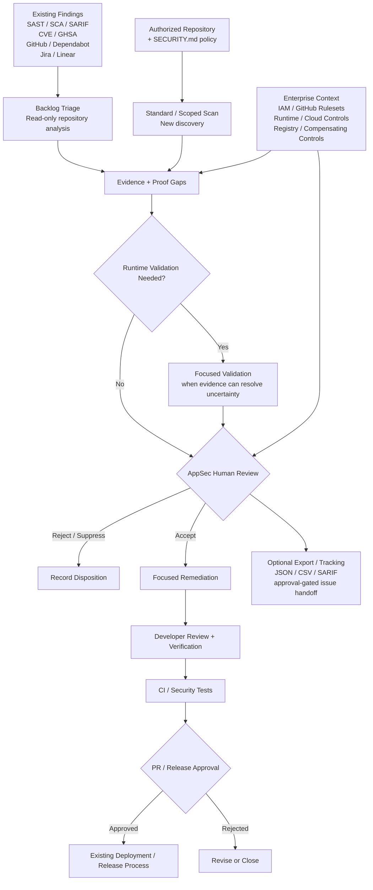

# Enterprise Workflow Architecture

## Design Principle

Codex Security augments the existing enterprise vulnerability-management and engineering workflow.

It can work in two complementary lanes:

1. **Existing backlog triage** — review supplied security findings against repository evidence.
2. **New discovery** — scan an authorized repository or scoped component for plausible vulnerabilities.

It does not replace upstream vulnerability normalization, enterprise governance, AppSec review, CI/CD controls, or production approval.

## Reference Workflow

## Workflow Notes

### Existing backlog triage

Backlog triage treats each supplied finding as an unproven claim and performs read-only static analysis against the repository. Runtime validation is a separate follow-up when static evidence leaves material uncertainty.

### New vulnerability discovery

A standard or scoped scan performs threat modeling, finding discovery, validation or other checks, impact/path analysis, reporting, and coverage tracking.

### Finding handoff

Accepted findings can be exported as portable artifacts or prepared for approval-gated tracking in supported issue-management workflows.

## Enterprise Context

Important context may exist outside the repository, including:

- IAM
- GitHub rulesets
- runtime controls
- cloud configuration
- registry permissions
- compensating controls

This context informs attack-path interpretation, severity, and final human risk decisions.

## Human Decision Boundaries

### AppSec / Product Security

Owns:

- finding disposition
- severity
- enterprise-context validation
- selection of findings for runtime validation
- security acceptance

### Development

Owns:

- application correctness
- remediation review
- tests
- pull-request approval

### Platform / DevOps / Security Engineering

Owns:

- CI/CD controls
- source-control governance
- release protections
- credentials
- deployment controls

## Automation Boundary

Codex Security may assist with:

- repository understanding
- backlog triage
- vulnerability discovery
- attack-path reasoning
- validation evidence and proof-gap identification
- remediation proposals
- structured export and approval-gated issue preparation

The pilot does not permit Codex Security to autonomously:

- accept risk
- merge code
- release software
- deploy to production

## Product Boundary for This Pilot

The original vulnerability-operations scenario includes normalization and deduplication. This pilot does not assume Codex Security replaces the customer's upstream vulnerability-management data pipeline. Existing normalization and deduplication remain in the surrounding workflow unless explicitly validated during the pilot.

## Scale-Out Path

A successful pilot can progress from:

**Security Workbench / focused repository reviews**
→ **CLI bulk scanning against pinned repository revisions**
→ **diff-focused CI scanning and SARIF export**
→ **selected enforcement only after quality and operating thresholds are proven**

## Key Architectural Constraint

Repository analysis alone cannot establish all enterprise controls. Human reviewers must validate external controls before making final risk decisions.
