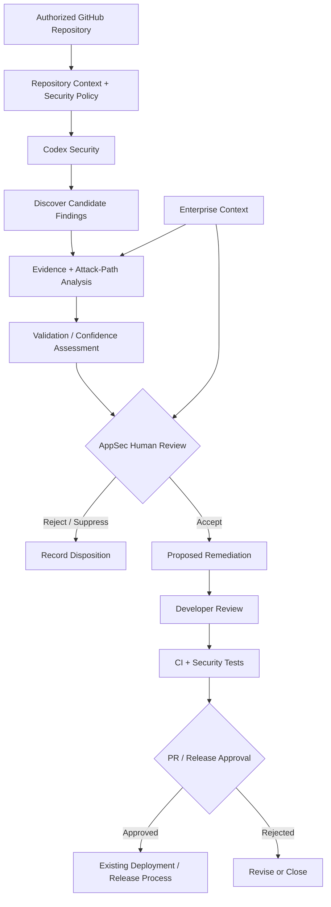

# Enterprise Workflow Architecture

## Design Principle

Codex Security augments the existing enterprise security and engineering workflow.

It does not replace source-control governance, CI/CD controls, AppSec review, or production approval.

## Reference Workflow

## Enterprise Context

Important context may exist outside the repository, including:

- IAM
- GitHub rulesets
- runtime controls
- cloud configuration
- registry permissions
- compensating controls

This context informs both attack-path interpretation and final human risk decisions.

## Human Decision Boundaries

### AppSec / Product Security

Owns finding disposition, severity, enterprise-context validation, and security acceptance.

### Development

Owns application correctness, remediation review, tests, and pull-request approval.

### Platform / DevOps / Security Engineering

Owns CI/CD controls, source-control governance, release protections, credentials, and deployment controls.

## Automation Boundary

Codex Security may assist with repository understanding, vulnerability discovery, attack-path reasoning, validation, and remediation proposals.

The pilot does not permit Codex Security to autonomously accept risk, merge code, release software, or deploy to production.

## Key Architectural Constraint

Repository analysis alone cannot establish all enterprise controls. Human reviewers must validate external controls before making final risk decisions.
